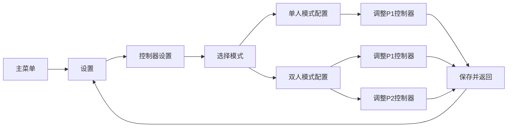
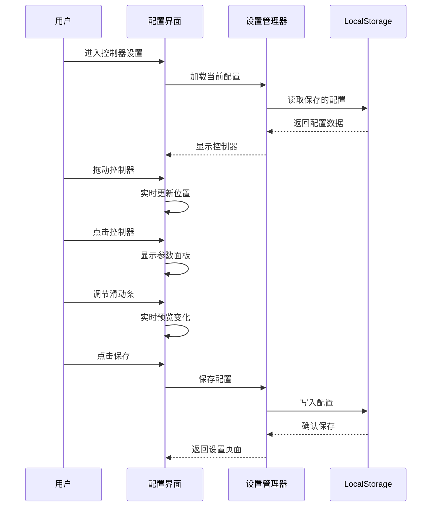

# 触摸控制器自定义功能设计方案

## 功能概述

在设置菜单中添加"控制器设置"选项（仅触摸设备显示），允许用户可视化地自定义摇杆和开火键的位置、大小和参数。

## 核心功能

### 1. 可拖动调整位置
- 用户可以长按并拖动摇杆或开火键到任意位置
- 实时预览拖动效果
- 松手后保存新位置

### 2. 参数调节面板
- 点击控制器后弹出调节面板
- 面板包含滑动条，可调节：
  - **摇杆大小**：外圈半径（40-80px）
  - **摇杆死区**：静止判定范围（0-20px）
  - **开火键大小**：按钮半径（30-60px）
- 实时预览参数变化

### 3. 配置持久化
- 使用 localStorage 保存用户配置
- 支持重置为默认值
- 支持单人/双人模式独立配置

## 技术架构

### 数据结构

```javascript
// 控制器配置对象
const ControlsConfig = {
  singlePlayer: {
    joystick: {
      x: 100,
      y: 520,
      outerRadius: 60,
      innerRadius: 25,
      maxDistance: 50,
      deadZone: 5
    },
    fireButton: {
      x: 740,
      y: 520,
      radius: 45
    }
  },
  dualPlayer: {
    player1: {
      joystick: { x: 100, y: 100, outerRadius: 60, ... },
      fireButton: { x: 100, y: 520, radius: 45 }
    },
    player2: {
      joystick: { x: 740, y: 100, outerRadius: 60, ... },
      fireButton: { x: 740, y: 520, radius: 45 }
    }
  }
}
```

### 状态流转



### 交互流程



## 界面设计

### 控制器配置界面布局

```
┌─────────────────────────────────────┐
│         控制器设置                    │
├─────────────────────────────────────┤
│                                     │
│  [单人模式] [双人模式]               │
│                                     │
│  ┌─────────────────────────────┐   │
│  │                             │   │
│  │    ⊕ 摇杆    🎯 开火键      │   │
│  │   (可拖动)   (可拖动)       │   │
│  │                             │   │
│  │  提示：长按拖动调整位置      │   │
│  │       点击显示参数设置       │   │
│  └─────────────────────────────┘   │
│                                     │
│  [重置默认] [保存] [返回]           │
└─────────────────────────────────────┘
```

### 参数调节面板

```
┌─────────────────────────────┐
│   摇杆参数设置               │
├─────────────────────────────┤
│                             │
│  大小：  ●────────○  60px   │
│         40        80        │
│                             │
│  死区：  ●──○──────  5px    │
│         0         20        │
│                             │
│  [确定] [取消]              │
└─────────────────────────────┘
```

## 实现细节

### 1. ControlsSettings 类（配置管理）

**职责**：
- 加载/保存配置到 localStorage
- 提供默认配置
- 验证配置有效性
- 应用配置到 InputManager

**关键方法**：
```javascript
class ControlsSettings {
  static load()           // 从 localStorage 加载
  static save(config)     // 保存到 localStorage
  static getDefault()     // 获取默认配置
  static reset()          // 重置为默认
  static validate(config) // 验证配置有效性
  static apply(input)     // 应用到 InputManager
}
```

### 2. ControlsConfigUI 类（配置界面）

**职责**：
- 渲染配置界面
- 处理拖动交互
- 显示参数调节面板
- 实时预览效果

**状态**：
```javascript
{
  mode: 'single' | 'dual',     // 当前配置模式
  selectedPlayer: 0 | 1,        // 双人模式下选中的玩家
  dragTarget: null,             // 当前拖动的控制器
  showPanel: false,             // 是否显示参数面板
  panelTarget: null,            // 参数面板对应的控制器
  tempConfig: {...}             // 临时配置（未保存）
}
```

**交互处理**：
- `onTouchStart`: 检测点击/长按
- `onTouchMove`: 处理拖动
- `onTouchEnd`: 完成拖动/点击
- `onSliderChange`: 处理滑动条变化

### 3. InputManager 扩展

**新增功能**：
- 从 ControlsSettings 加载配置
- 支持动态更新控制器参数
- 使用配置的位置和大小

**修改点**：
```javascript
// 构造函数中加载配置
constructor() {
  // ... 现有代码
  this.config = ControlsSettings.load();
  this._applyConfig();
}

// 应用配置
_applyConfig() {
  const cfg = this.config.singlePlayer;
  this.joysticks[0].centerX = cfg.joystick.x;
  this.joysticks[0].centerY = cfg.joystick.y;
  // ... 应用其他参数
}

// 更新配置
updateConfig(config) {
  this.config = config;
  this._applyConfig();
}
```

### 4. Renderer 扩展

**新增功能**：
- 支持绘制不同大小的控制器
- 配置模式下显示拖动提示
- 显示参数调节面板

**修改点**：
```javascript
// 使用配置的半径绘制
drawTouchJoystick(joystick, playerIndex, config) {
  const outerRadius = config?.outerRadius || TOUCH_JOYSTICK_OUTER_RADIUS;
  const innerRadius = config?.innerRadius || TOUCH_JOYSTICK_INNER_RADIUS;
  // ... 使用配置的参数绘制
}

// 新增：绘制参数面板
drawControlPanel(x, y, params) {
  // 绘制半透明背景
  // 绘制滑动条
  // 绘制数值显示
}
```

### 5. Menu 扩展

**修改点**：
- 设置页面添加"控制器设置"选项（仅触摸设备）
- 处理进入控制器配置界面的逻辑

```javascript
// 在 _drawSettings 中添加新选项
const items = [
  { label: t('language'), value: t('langName') },
  { label: t('theme'), value: t(Theme.current === 'light' ? 'themeLight' : 'themeDark') },
  // 新增：仅触摸设备显示
  ...(this._input.isTouchDevice ? [{ label: t('controlsConfig'), value: '' }] : []),
  { label: t('back'), value: '' },
];
```

## 配置存储格式

```javascript
// localStorage key: 'tankgame_controls'
{
  version: 1,  // 配置版本号，用于未来升级
  singlePlayer: {
    joystick: {
      x: 100,
      y: 520,
      outerRadius: 60,
      innerRadius: 25,
      maxDistance: 50,
      deadZone: 5
    },
    fireButton: {
      x: 740,
      y: 520,
      radius: 45
    }
  },
  dualPlayer: {
    player1: {
      joystick: { x: 100, y: 100, outerRadius: 60, innerRadius: 25, maxDistance: 50, deadZone: 5 },
      fireButton: { x: 100, y: 520, radius: 45 }
    },
    player2: {
      joystick: { x: 740, y: 100, outerRadius: 60, innerRadius: 25, maxDistance: 50, deadZone: 5 },
      fireButton: { x: 740, y: 520, radius: 45 }
    }
  }
}
```

## 用户体验优化

### 1. 拖动体验
- 长按 300ms 后进入拖动模式
- 拖动时控制器半透明显示
- 显示网格辅助对齐
- 边界限制（不能拖出屏幕）

### 2. 参数调节
- 滑动条实时预览
- 显示当前数值
- 提供推荐值标记
- 支持快速重置单个参数

### 3. 视觉反馈
- 选中状态高亮显示
- 拖动时显示阴影
- 参数变化时动画过渡
- 保存成功提示

### 4. 防误操作
- 拖动距离阈值（>10px 才算拖动）
- 确认保存对话框
- 重置前二次确认
- 支持取消操作

## 兼容性考虑

### 1. 旧配置迁移
- 检测配置版本号
- 自动迁移旧格式
- 缺失字段使用默认值

### 2. 屏幕尺寸适配
- 配置保存相对位置（百分比）
- 加载时转换为绝对坐标
- 不同屏幕尺寸自动调整

### 3. 降级方案
- localStorage 不可用时使用内存配置
- 配置损坏时自动重置
- 提供手动重置选项

## 测试要点

1. **功能测试**
   - 拖动位置保存正确
   - 参数调节生效
   - 配置持久化
   - 重置功能正常

2. **交互测试**
   - 拖动流畅无卡顿
   - 点击响应准确
   - 滑动条操作顺畅
   - 多点触控不冲突

3. **边界测试**
   - 控制器不能拖出屏幕
   - 参数范围限制有效
   - 配置数据验证
   - 异常数据处理

4. **兼容性测试**
   - 不同屏幕尺寸
   - 横竖屏切换
   - 不同浏览器
   - 旧配置迁移

## 实现优先级

### P0（核心功能）
1. ControlsSettings 配置管理
2. 基础拖动功能
3. 配置保存/加载
4. 应用配置到游戏

### P1（重要功能）
1. 参数调节面板
2. 实时预览
3. 重置功能
4. 单人/双人模式切换

### P2（优化功能）
1. 视觉反馈优化
2. 网格辅助对齐
3. 动画过渡
4. 操作提示

## 预估工作量

- 配置管理系统：简单
- 拖动交互实现：中等
- 参数面板UI：中等
- 集成和测试：简单

总体复杂度：中等

## 风险和挑战

1. **触摸事件冲突**
   - 风险：配置界面的触摸事件可能与游戏控制器冲突
   - 方案：使用独立的事件处理器，配置模式下禁用游戏控制

2. **配置数据同步**
   - 风险：配置更新后需要同步到多个组件
   - 方案：使用观察者模式或事件系统

3. **屏幕适配**
   - 风险：不同屏幕尺寸下位置可能不合适
   - 方案：使用相对坐标 + 边界检测

4. **性能影响**
   - 风险：实时预览可能影响性能
   - 方案：节流处理，限制更新频率
