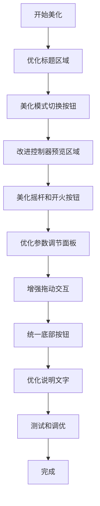
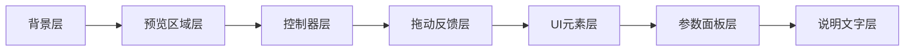
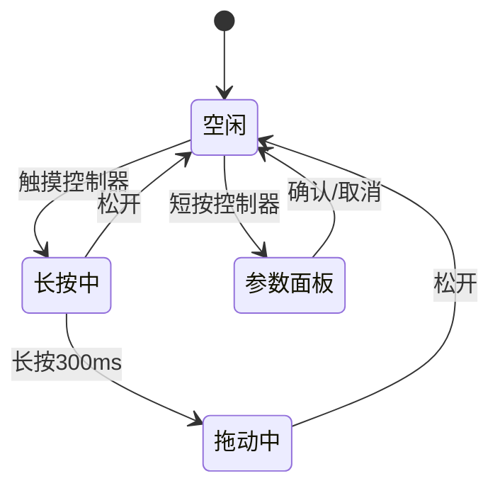

# 控制器配置界面美化方案

## 一、当前问题分析

### 1.1 视觉不一致性
- **标题样式简陋**：当前标题只是简单的文字，缺乏与主菜单相同的视觉冲击力
- **按钮风格不统一**：模式切换按钮、底部操作按钮、参数面板按钮的样式各不相同
- **缺乏视觉层次**：所有元素平铺，没有明确的主次关系

### 1.2 交互反馈不足
- **拖动状态不明显**：只有透明度变化（0.5），缺乏其他视觉提示
- **长按反馈缺失**：300ms 长按没有进度指示
- **参数调节不直观**：滑动条的当前值不够突出

### 1.3 色彩方案问题
- **死区圆圈颜色刺眼**：黄色/品红色在深色/浅色主题下对比度过高
- **控制器颜色单调**：摇杆和开火按钮缺乏渐变和光影效果
- **预览区域过于朴素**：背景只有简单的半透明填充

## 二、设计原则

### 2.1 与主程序风格保持一致
- 使用 [`Theme.colors`](js/theme.js:32) 中定义的颜色系统
- 采用 [`menu.js`](js/menu.js:307) 中的标题样式（bold 48px monospace）
- 保持 monospace 字体家族的统一性

### 2.2 提升视觉层次
- **第一层**：标题和说明文字（最高优先级）
- **第二层**：控制器预览区域（核心内容）
- **第三层**：操作按钮（辅助功能）
- **第四层**：参数面板（弹出层）

### 2.3 增强交互反馈
- 添加悬停/按下状态的视觉变化
- 长按操作显示进度环
- 拖动时显示阴影和位置辅助线

## 三、具体美化方案

### 3.1 标题区域优化

#### 当前实现
```javascript
// controlsConfig.js:360-365
ctx.font = 'bold 32px monospace';
ctx.fillStyle = Theme.colors.text.primary;
ctx.textAlign = 'center';
ctx.textBaseline = 'top';
ctx.fillText(t('controlsConfigTitle'), CANVAS_W / 2, 30);
```

#### 优化方案
1. **增大标题字号**：从 32px 提升到 40px，与主菜单的 48px 形成合理层级
2. **添加副标题**：在标题下方添加说明文字（14px，hint 颜色）
3. **添加装饰线**：标题下方绘制渐变装饰线，使用坦克颜色

```javascript
// 标题
ctx.font = 'bold 40px monospace';
ctx.fillStyle = Theme.colors.text.primary;
ctx.fillText(t('controlsConfigTitle'), CANVAS_W / 2, 35);

// 副标题
ctx.font = '14px monospace';
ctx.fillStyle = Theme.colors.text.hint;
ctx.fillText(t('controlsConfigSubtitle'), CANVAS_W / 2, 75);

// 装饰线
const lineY = 95;
const lineW = 200;
const grad = ctx.createLinearGradient(
    CANVAS_W/2 - lineW/2, lineY,
    CANVAS_W/2 + lineW/2, lineY
);
grad.addColorStop(0, 'transparent');
grad.addColorStop(0.5, Theme.colors.tanks[0]);
grad.addColorStop(1, 'transparent');
ctx.strokeStyle = grad;
ctx.lineWidth = 2;
ctx.beginPath();
ctx.moveTo(CANVAS_W/2 - lineW/2, lineY);
ctx.lineTo(CANVAS_W/2 + lineW/2, lineY);
ctx.stroke();
```

### 3.2 模式切换按钮美化

#### 当前实现
- 简单的圆角矩形
- 选中状态使用渐变填充
- 未选中状态使用半透明填充

#### 优化方案
1. **添加图标**：在按钮文字前添加简单的图标（单人/双人）
2. **增强选中效果**：添加发光效果和边框动画
3. **统一按钮高度**：从 35px 提升到 40px，增加点击区域

```javascript
// 选中状态增强
if (selected) {
    // 外发光
    ctx.shadowColor = Theme.colors.tanks[0];
    ctx.shadowBlur = 15;
    
    // 渐变填充
    const grad = ctx.createLinearGradient(btn.x, btn.y, btn.x, btn.y + btn.h);
    grad.addColorStop(0, Theme.colors.tanks[0]);
    grad.addColorStop(1, Theme.colors.tanks[1] || Theme.colors.tanks[0]);
    ctx.fillStyle = grad;
    ctx.fill();
    
    // 高亮边框
    ctx.shadowBlur = 0;
    ctx.strokeStyle = '#FFFFFF';
    ctx.lineWidth = 2;
    ctx.stroke();
}
```

### 3.3 控制器预览区域改进

#### 当前实现
- 简单的圆角矩形边框
- 网格背景（透明度 0.1）
- 控制器直接绘制在背景上

#### 优化方案
1. **添加内阴影效果**：使用多层描边模拟凹陷感
2. **优化网格样式**：使用点阵代替线条，减少视觉干扰
3. **添加区域标签**：在预览区域顶部显示"预览区域"文字
4. **添加辅助线**：拖动时显示对齐辅助线

```javascript
// 内阴影效果（多层描边）
for (let i = 0; i < 3; i++) {
    ctx.strokeStyle = Theme.current === 'dark' 
        ? `rgba(0,0,0,${0.15 - i * 0.05})`
        : `rgba(0,0,0,${0.1 - i * 0.03})`;
    ctx.lineWidth = 3 - i;
    ctx.stroke();
}

// 点阵背景
ctx.save();
ctx.globalAlpha = 0.15;
ctx.fillStyle = Theme.colors.text.hint;
const dotSize = 2;
const dotGap = 30;
for (let gx = x + dotGap; gx < x + w; gx += dotGap) {
    for (let gy = y + dotGap; gy < y + h; gy += dotGap) {
        ctx.beginPath();
        ctx.arc(gx, gy, dotSize, 0, Math.PI * 2);
        ctx.fill();
    }
}
ctx.restore();

// 区域标签
ctx.font = '12px monospace';
ctx.fillStyle = Theme.colors.text.hint;
ctx.textAlign = 'center';
ctx.fillText(t('previewArea'), x + w/2, y + 15);
```

### 3.4 摇杆和开火按钮美化

#### 当前问题
- 摇杆底座和摇杆头颜色单调
- 死区圆圈颜色过于刺眼（黄色/品红色）
- 开火按钮缺乏立体感

#### 优化方案

**摇杆优化**：
1. **底座渐变**：从中心向外的径向渐变
2. **摇杆头光泽**：添加高光效果
3. **死区圆圈柔和化**：使用半透明白色虚线，降低对比度

```javascript
// 底座径向渐变
const baseGrad = ctx.createRadialGradient(
    config.x, config.y, 0,
    config.x, config.y, config.outerRadius
);
baseGrad.addColorStop(0, isDark ? 'rgba(255,255,255,0.15)' : 'rgba(0,0,0,0.15)');
baseGrad.addColorStop(1, isDark ? 'rgba(255,255,255,0.05)' : 'rgba(0,0,0,0.05)');
ctx.fillStyle = baseGrad;

// 摇杆头光泽
const headGrad = ctx.createRadialGradient(
    config.x - config.innerRadius * 0.3,
    config.y - config.innerRadius * 0.3,
    0,
    config.x, config.y,
    config.innerRadius
);
headGrad.addColorStop(0, lightenColor(playerColor, 0.3));
headGrad.addColorStop(1, playerColor);
ctx.fillStyle = headGrad;

// 死区圆圈柔和化
ctx.strokeStyle = 'rgba(255,255,255,0.4)'; // 半透明白色
ctx.lineWidth = 2;
ctx.setLineDash([4, 4]);
```

**开火按钮优化**：
1. **增强立体感**：添加内阴影和高光
2. **准星优化**：使用更细腻的绘制方式

```javascript
// 按钮阴影
ctx.shadowColor = 'rgba(0,0,0,0.3)';
ctx.shadowBlur = 8;
ctx.shadowOffsetY = 3;

// 按钮渐变（增强立体感）
const grad = ctx.createRadialGradient(
    config.x - config.radius * 0.3,
    config.y - config.radius * 0.3,
    0,
    config.x, config.y,
    config.radius
);
grad.addColorStop(0, '#FF8787');
grad.addColorStop(0.6, '#FF6B6B');
grad.addColorStop(1, '#C0392B');

// 高光
ctx.beginPath();
ctx.arc(
    config.x - config.radius * 0.25,
    config.y - config.radius * 0.25,
    config.radius * 0.3,
    0, Math.PI * 2
);
ctx.fillStyle = 'rgba(255,255,255,0.3)';
ctx.fill();
```

### 3.5 参数调节面板美化

#### 当前实现
- 简单的圆角矩形面板
- 基础的滑动条设计
- 确认/取消按钮样式简单

#### 优化方案
1. **面板背景优化**：添加模糊背景效果（使用半透明深色遮罩）
2. **滑动条增强**：添加刻度标记和数值提示
3. **按钮统一化**：与底部按钮使用相同的样式系统

```javascript
// 背景遮罩（模拟模糊效果）
ctx.fillStyle = 'rgba(0,0,0,0.5)';
ctx.fillRect(0, 0, CANVAS_W, CANVAS_H);

// 面板背景（毛玻璃效果）
ctx.fillStyle = Theme.current === 'dark'
    ? 'rgba(40,40,40,0.95)'
    : 'rgba(255,255,255,0.95)';
ctx.fill();

// 面板边框发光
ctx.shadowColor = Theme.colors.tanks[0];
ctx.shadowBlur = 20;
ctx.strokeStyle = Theme.colors.tanks[0];
ctx.lineWidth = 2;
ctx.stroke();

// 滑动条刻度
const steps = 5;
for (let i = 0; i <= steps; i++) {
    const tickX = x + (w / steps) * i;
    ctx.strokeStyle = Theme.colors.text.hint;
    ctx.lineWidth = 1;
    ctx.beginPath();
    ctx.moveTo(tickX, y - 5);
    ctx.lineTo(tickX, y + 5);
    ctx.stroke();
}

// 当前值提示（在滑块上方）
ctx.font = 'bold 14px monospace';
ctx.fillStyle = Theme.colors.text.primary;
ctx.textAlign = 'center';
ctx.fillText(Math.round(value), knobX, y - 20);
```

### 3.6 拖动交互增强

#### 当前实现
- 只有透明度变化（alpha = 0.5）
- 长按 300ms 后才能拖动

#### 优化方案
1. **长按进度环**：显示长按进度（0-300ms）
2. **拖动阴影**：拖动时增加阴影效果
3. **位置辅助线**：显示水平/垂直对齐线
4. **边界提示**：接近边界时显示红色警告

```javascript
// 长按进度环（在控制器周围）
if (this.longPressTimer > 0 && this.dragTarget) {
    const progress = 1 - (this.longPressTimer / 0.3);
    const cfg = this._getControllerConfig(this.dragTarget);
    const radius = this.dragTarget.type === 'joystick' 
        ? cfg.outerRadius + 10 
        : cfg.radius + 10;
    
    ctx.strokeStyle = Theme.colors.tanks[0];
    ctx.lineWidth = 4;
    ctx.beginPath();
    ctx.arc(cfg.x, cfg.y, radius, -Math.PI/2, -Math.PI/2 + Math.PI * 2 * progress);
    ctx.stroke();
}

// 拖动阴影
if (this.isDragging && this.dragTarget) {
    ctx.shadowColor = 'rgba(0,0,0,0.5)';
    ctx.shadowBlur = 20;
    ctx.shadowOffsetX = 5;
    ctx.shadowOffsetY = 5;
}

// 对齐辅助线
if (this.isDragging && this.dragTarget) {
    const cfg = this._getControllerConfig(this.dragTarget);
    ctx.strokeStyle = 'rgba(100,200,255,0.5)';
    ctx.lineWidth = 1;
    ctx.setLineDash([5, 5]);
    
    // 水平线
    ctx.beginPath();
    ctx.moveTo(0, cfg.y);
    ctx.lineTo(CANVAS_W, cfg.y);
    ctx.stroke();
    
    // 垂直线
    ctx.beginPath();
    ctx.moveTo(cfg.x, 0);
    ctx.lineTo(cfg.x, CANVAS_H);
    ctx.stroke();
    
    ctx.setLineDash([]);
}
```

### 3.7 底部按钮统一化

#### 当前实现
- 三个按钮样式不一致
- 缺乏悬停反馈（触摸设备）

#### 优化方案
1. **统一按钮样式**：使用与模式切换按钮相同的设计
2. **添加图标**：重置（↻）、保存（✓）、返回（←）
3. **颜色区分**：保存按钮使用绿色，重置使用橙色，返回使用灰色

```javascript
_drawButton(ctx, btn, text, type, selected) {
    const colors = {
        reset: { normal: '#FF9800', hover: '#FB8C00' },
        save: { normal: '#4CAF50', hover: '#43A047' },
        back: { normal: '#757575', hover: '#616161' }
    };
    
    const color = colors[type] || colors.back;
    
    // 按钮背景
    ctx.fillStyle = selected ? color.hover : color.normal;
    // ... 圆角矩形绘制
    
    // 图标
    const icons = {
        reset: '↻',
        save: '✓',
        back: '←'
    };
    ctx.font = 'bold 20px monospace';
    ctx.fillText(icons[type] + ' ' + text, btn.x + btn.w/2, btn.y + btn.h/2);
}
```

### 3.8 说明文字优化

#### 当前实现
- 只有简单的提示文字
- 位置固定在底部

#### 优化方案
1. **添加操作说明**：在预览区域下方显示详细的操作指南
2. **使用图标**：长按（⏱）、拖动（✋）、点击（👆）
3. **分步骤说明**：使用编号列表

```javascript
// 操作说明
const instructions = [
    { icon: '👆', text: t('tapToOpenPanel') },
    { icon: '⏱', text: t('longPressToDrag') },
    { icon: '✋', text: t('dragToMove') }
];

ctx.font = '13px monospace';
ctx.fillStyle = Theme.colors.text.secondary;
ctx.textAlign = 'left';

let instrY = CANVAS_H - 120;
instructions.forEach((instr, i) => {
    ctx.fillText(`${i+1}. ${instr.icon} ${instr.text}`, 60, instrY);
    instrY += 25;
});
```

## 四、颜色方案优化

### 4.1 主题适配增强

#### 浅色主题
- **背景**：保持 `#F5F0E1`
- **控制器底座**：`rgba(0,0,0,0.08)` → `rgba(0,0,0,0.12)`（增强对比度）
- **预览区域**：添加微妙的纸张纹理效果

#### 深色主题
- **背景**：保持 `#2B2B2B`
- **控制器底座**：`rgba(255,255,255,0.1)` → `rgba(255,255,255,0.15)`（增强可见性）
- **预览区域**：添加微妙的碳纤维纹理效果

### 4.2 玩家颜色统一

使用 [`Theme.colors.tanks`](js/theme.js:8) 中定义的颜色：
- **玩家1**：`#E74C3C`（浅色）/ `#E57368`（深色）
- **玩家2**：`#3498DB`（浅色）/ `#6BB6E8`（深色）

### 4.3 辅助颜色定义

```javascript
const UI_COLORS = {
    success: { light: '#4CAF50', dark: '#66BB6A' },
    warning: { light: '#FF9800', dark: '#FFA726' },
    danger: { light: '#F44336', dark: '#EF5350' },
    info: { light: '#2196F3', dark: '#42A5F5' }
};
```

## 五、实现优先级

### 高优先级（核心视觉改进）
1. ✅ 标题区域优化（3.1）
2. ✅ 模式切换按钮美化（3.2）
3. ✅ 摇杆和开火按钮美化（3.4）
4. ✅ 参数调节面板美化（3.5）

### 中优先级（交互体验提升）
5. ✅ 拖动交互增强（3.6）
6. ✅ 底部按钮统一化（3.7）
7. ✅ 控制器预览区域改进（3.3）

### 低优先级（锦上添花）
8. ✅ 说明文字优化（3.8）
9. ✅ 颜色方案优化（4.1-4.3）

## 六、技术实现要点

### 6.1 性能考虑
- 避免在 `draw()` 方法中创建过多临时对象
- 缓存渐变对象（在构造函数中创建）
- 使用 `ctx.save()`/`ctx.restore()` 管理状态

### 6.2 兼容性
- 所有效果使用 Canvas 2D API，无需 WebGL
- 触摸事件处理保持现有逻辑
- 主题切换时自动更新颜色

### 6.3 国际化
需要在 [`i18n.js`](js/i18n.js:1) 中添加新的翻译键：
- `controlsConfigSubtitle`：控制器配置副标题
- `previewArea`：预览区域标签
- `tapToOpenPanel`：点击打开参数面板
- `longPressToDrag`：长按拖动控制器
- `dragToMove`：拖动移动位置

## 七、测试要点

### 7.1 视觉测试
- [ ] 浅色主题下所有元素清晰可见
- [ ] 深色主题下所有元素清晰可见
- [ ] 单人模式和双人模式切换正常
- [ ] 拖动时视觉反馈明显

### 7.2 交互测试
- [ ] 长按进度环显示正确
- [ ] 拖动时辅助线显示正确
- [ ] 参数面板滑动条响应流畅
- [ ] 按钮点击反馈及时

### 7.3 性能测试
- [ ] 60fps 流畅渲染
- [ ] 无明显卡顿或延迟
- [ ] 内存占用稳定

## 八、Mermaid 流程图

### 8.1 美化实现流程



### 8.2 渲染层次结构



### 8.3 交互状态机



## 九、总结

本美化方案遵循以下核心原则：
1. **一致性**：与主程序的视觉风格保持一致
2. **层次性**：清晰的视觉层次，突出重点内容
3. **反馈性**：丰富的交互反馈，提升用户体验
4. **适配性**：完美支持浅色/深色主题切换

通过这些优化，控制器配置界面将从功能性界面提升为具有良好用户体验的精致界面。
